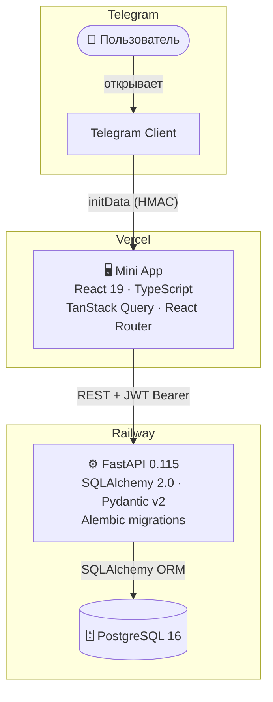
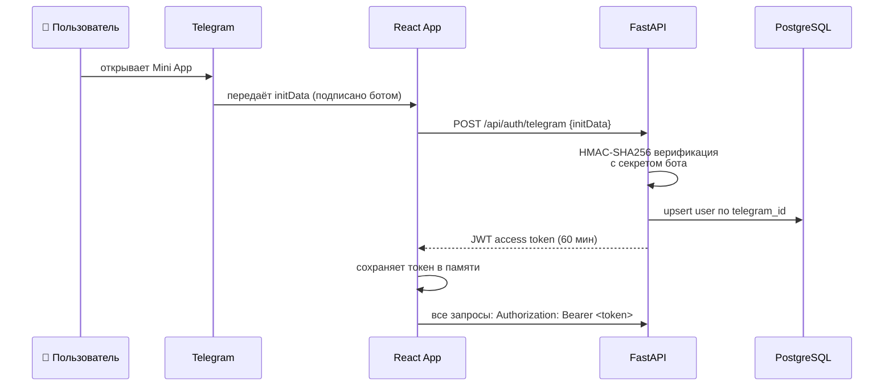
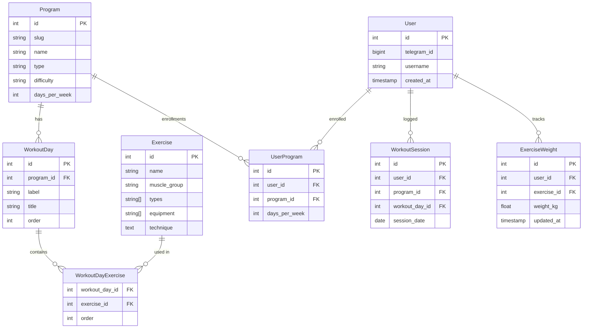

<div align="center">


# GYM APP

**Telegram Mini App для структурированных тренировок**

[](https://fastapi.tiangolo.com)
[](https://python.org)
[](https://react.dev)
[](https://typescriptlang.org)
[](https://postgresql.org)

[](https://railway.app)
[](https://vercel.com)
[](./backend/tests)

[**→ API Docs**](https://gym-production-4052.up.railway.app/docs)

</div>

---

## Что это

Gym App — полноценный Telegram Mini App для тренировок. Пользователь открывает приложение прямо внутри Telegram: выбирает программу, следует расписанию, записывает веса, отслеживает прогресс и серии.

Авторизация через **Telegram initData + HMAC верификацию** — никакого отдельного логина.

---

## Экраны

<table>
<tr>
<td width="50%" valign="top">

### 🏠 Dashboard
Список программ с цветовой кодировкой по типу тренировки. У каждой карточки — кольцевой индикатор прогресса текущей недели.

- Цветная полоса слева: гипертрофия / сила / кардио / калистеника
- Кольцо прогресса `3 / 5` — выполнено из запланированных
- Бейджи сложности и рекомендуемых дней в неделю
- Новые программы помечены меткой **NEW**

</td>
<td width="50%" valign="top">

### 📋 Program
Цикличное расписание тренировочных дней с автосдвигом по истории сессий.

- Текущая тренировка выделена меткой **→ Следующая**
- Выполненные дни приглушены со значком ✓
- Программа открывается через онбординг: выбор частоты тренировок (1–7 дней в неделю)

</td>
</tr>
<tr>
<td width="50%" valign="top">

### 📊 Stats
Полная картина прогресса пользователя на одном экране.

- Прогресс-бар текущей недели: выполнено / запланировано
- Две серии: 🔥 недельная и ⚡ тренировочная (интервал ≤ 7 дней)
- Месячный календарь активности (7-колоночная сетка по неделям)
- Личные рекорды по весам с датой достижения

</td>
<td width="50%" valign="top">

### 📚 Library
База из 150+ упражнений с двухуровневой фильтрацией.

- Горизонтальный скролл по 13 группам мышц
- Фильтр по типу программы: <kbd>Масса</kbd> <kbd>Сила</kbd> <kbd>HIIT</kbd> <kbd>Калистеника</kbd>
- Карточка упражнения: техника выполнения, теги оборудования, ссылки на программы где используется
- Аккордеон: разворачивается по тапу

</td>
</tr>
</table>

---

## Ключевые возможности

| | Возможность | Детали |
|---|---|---|
| 🗓️ | **Расписание** | Цикличное расписание дней, адаптируется под частоту тренировок пользователя (1–7 дн/нед) |
| 🔄 | **Замена упражнений** | Любое упражнение можно заменить альтернативой из той же группы мышц |
| ⚖️ | **История весов** | Вес по каждому упражнению сохраняется между сессиями |
| 🔥 | **Серии** | Две независимые серии: недельная и тренировочная (интервал ≤ 7 дней) |
| 📊 | **Статистика** | Месячный календарь, недельный прогресс, личные рекорды по весам |
| 📚 | **База упражнений** | 150+ упражнений по 13 группам мышц с техникой выполнения |
| 🎯 | **Онбординг** | Выбор программы и цели по дням в неделю при первом запуске |

---

## Архитектура



---

## Аутентификация



---

## Стек технологий

| Слой | Технологии |
|---|---|
| **Backend** | FastAPI 0.115, SQLAlchemy 2.0 (async), Alembic, Pydantic v2 |
| **Database** | PostgreSQL 16, psycopg3 |
| **Auth** | Telegram initData HMAC-SHA256, JWT (python-jose) |
| **Frontend** | React 19, TypeScript, Vite, React Router v7 |
| **Server State** | TanStack Query v5 |
| **HTTP** | Axios с JWT-интерцептором |
| **Telegram SDK** | @twa-dev/sdk |
| **Fonts** | Bebas Neue (заголовки), Manrope (текст) |
| **Deploy** | Railway (backend + DB), Vercel (frontend) |
| **Tests** | pytest (backend), vitest (frontend) |

---

## API

| Метод | Эндпоинт | Описание |
|---|---|---|
| `POST` | `/api/auth/telegram` | Обмен initData на JWT |
| `GET` | `/api/programs` | Список программ (с прогрессом пользователя) |
| `GET` | `/api/programs/{slug}` | Детали программы + дни |
| `GET` | `/api/programs/{slug}/days/{id}` | День тренировки + упражнения |
| `POST` | `/api/sessions` | Записать выполненную тренировку |
| `GET` | `/api/stats` | Серия, календарь, рекорды |
| `GET` | `/api/exercises` | Упражнения с фильтрами |
| `GET` | `/api/exercises/{id}/programs` | В каких программах используется |
| `PUT` | `/api/weights/{exercise_id}` | Сохранить вес упражнения |
| `POST` | `/api/user-programs` | Записаться на программу |

Интерактивная документация: [Swagger UI](https://gym-production-4052.up.railway.app/docs)

---

## Схема базы данных



---

## Структура проекта

```
gym/
├── backend/
│   ├── app/
│   │   ├── auth/            # HMAC верификация, JWT, deps
│   │   ├── exercises/       # 150+ упражнений, 13 групп мышц
│   │   ├── programs/        # Программы и дни тренировок
│   │   ├── sessions/        # Запись выполненных тренировок
│   │   ├── stats/           # Серии, календарь, рекорды
│   │   ├── user_programs/   # Запись на программу, цель дн/нед
│   │   ├── weights/         # История весов по упражнениям
│   │   ├── models.py        # SQLAlchemy модели
│   │   ├── seed.py          # Сид данных (идемпотентный по slug)
│   │   └── main.py          # FastAPI app, CORS, middleware
│   ├── alembic/             # Миграции БД
│   └── tests/               # 20 тестов: серии, утилиты
└── frontend/
    └── src/
        ├── pages/           # Dashboard, Program, Library, Stats
        ├── components/      # BottomNav, OnboardingSheet, ErrorBoundary
        ├── api/             # Axios client, типизированные функции
        ├── hooks/           # useTelegram, useBackButton
        ├── utils/           # Логика календаря
        └── types/           # TypeScript интерфейсы
```

---

## Запуск локально

**Требования:** Python 3.12+, Node.js 20+, PostgreSQL

```bash
git clone https://github.com/LTYcsv/gym.git
cd gym
```

**Backend**

```bash
cd backend
python -m venv .venv && source .venv/bin/activate
pip install -r requirements.txt

cp .env.example .env
# заполни .env (DATABASE_URL, BOT_TOKEN, SECRET_KEY)

alembic upgrade head
python -m app.seed          # загружает 150+ упражнений и программы

uvicorn app.main:app --reload
# → http://localhost:8000
# → http://localhost:8000/docs  (Swagger UI)
```

**Frontend**

```bash
cd frontend
npm install
npm run dev
# → http://localhost:5174
# Vite автоматически проксирует /api → localhost:8000
```

---

## Тесты

```bash
# Backend — 20 тестов: логика серий, timezone utils
cd backend && python -m pytest tests/ -v

# Frontend — 8 тестов: генерация сетки календаря
cd frontend && npm test
```

---

## Деплой

| Сервис | Платформа | Конфиг |
|---|---|---|
| Backend API | Railway | `backend/railway.toml` |
| PostgreSQL | Railway Managed DB | переменные окружения |
| Frontend | Vercel | `frontend/vercel.json` |

Оба сервиса работают через HTTPS. Переменные окружения задаются в дашборде платформы — в репозитории только `.env.example` с плейсхолдерами.
